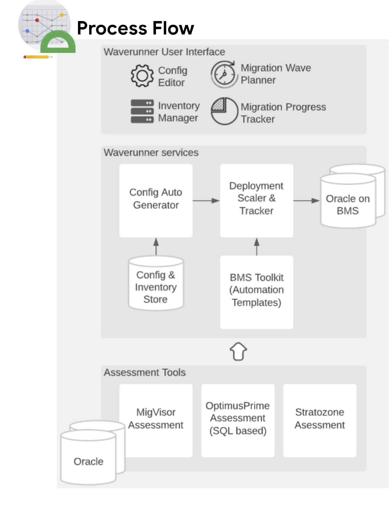

# Waverunner

WaveRunner aims to help GCP users looking to lift and shift Oracle workloads do so in an automated, simple and timely manner.  This highly scalable deployment framework will help customers achieve faster ramp on Google Cloud for their Oracle databases. 

This repository consists of the [`frontend`](frontend/README.md), [`backend`](backend/README.md), and  [`infrastructure deployment`](deploy/README.md) codebases.

## Contributing

See [`CONTRIBUTING.md`](CONTRIBUTING.md) for details.

## License

Apache 2.0; see [`LICENSE`](LICENSE) for details.

## Disclaimer

This project is not an official Google project. It is not supported by
Google and Google specifically disclaims all warranties as to its quality,
merchantability, or fitness for a particular purpose.