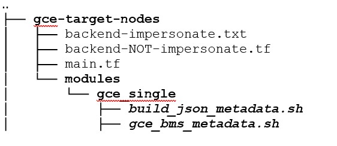

# <div align="center">Provisioning Resources on GCP with Terraform (Migscaler Migration Tool)</div>
# <div align="center">(MVP - Phase1)</div>
## First version: December 2021
## Changes for phase1 deliverable: February 2022


### Authors: EPAM Systems
<br>

# <div align="center">INDEX</div>


* INDEX
* INTRODUCTION
* 1. PRE-INSTALLATION REQUIREMENTS
  * 1.1 GIT REPOSITORY FOR TERRAFORM TEMPLATES
  * 1.2 TERRAFORM AUTHENTICATION
    * 1.2.1 GCP USER WITH OWNER ROLE
    * 1.2.2 IMPERSONATE A SERVICE ACCOUNT WITH SPECIFIC PERMISSIONS FOR RUNNING TERRAFORM
  * 1.3 TERRAFORM STATE FILE
    * 1.3.1 STEPS TO STORE TERRAFORM STATE IN A GCP BUCKET
* 2. STEPS TO CREATE THE RESOURCES
  * 2.1   INSTALL AND DEPLOY THE APPLICATION
  * 2.2   PROVISIONING GCEs FOR TARGET NODES
* 3. OUTPUT VALUES
* 4. TERRAFORM EXECUTION
* 5. ADDITIONAL INFORMATION ON TERRAFORM PROVISIONING PROCESS
  * 5.1   DNS WORKFLOW
  * 5.2 GCE PROVISIONING FOR TARGET NODES

# <div align="center">INTRODUCTION</div>


<p style='text-align: justify;'>This document, intended for the MVP - Phase 1 of the project, describes the procedure for provisioning GCP environments to install the BMS toolkit application, through which the installation of the ORACLE software and databases is automated on Google cloud.</p>

<p style='text-align: justify;'>The end-to-end process is expected to be performed by the infrastructure as a code approach; in this case using the well-known Hashicorp Terraform tool.</p>

<p style='text-align: justify;'>An important point to highlight before getting into the actual process is that, in general, the infrastructure provisioning process with Terraform is very flexible. That is, we can decide to keep most of the parameters with default values, or we can choose to customize the GCP environment with ID, names and capacity based on specific needs. Both use cases are valid to provision any cloud infrastructure as we will see in this document.</p>

<p style='text-align: justify;'>At high level the input parameters are organized into required and optional. Examples of required parameters are GCP Project ID and the Region where GCP resources will be provisioned. Examples of optional parameters could be the bucket name or the database name.</p>

<p style='text-align: justify;'>In this document we will describe the process to fill in the required values and have terraform provision the GCP environment. To achieve it some parameter values are required (only in root module main.tf file) with which terraform plan | apply will create those resources. There are basically two root modules: One for GCP foundation resources and one for GCE (to simulate BMS servers - single instances).</p>

Short action plan:
1. Meets GCP project requirements
2. Clone terraform code repo
3. Change required parameters
4. Apply terraform configuration
5. Optional. Destroy previously created resources</p>

<br>
<br>

# 1. PRE-INSTALLATION REQUIREMENTS

<p style='text-align: justify;'>The procedure described below assumes that an existing GCP project is in place with billing enabled. Additionally, all GCP resources created with this procedure will generate billing to the GCP account through which terraform authenticates.
The GCP resources to be created in this process include API services, GCS (bucket), Service account / custom role / IAM permissions, Networks (public VPC), Cloud SQL (postgresql), Pub/sub, GCE (to simulate Oracle software installations with single modes), DNS ?A? records, Cloud run services, and Cloud Identity-Aware Proxy (Load Balancer, Network Endpoint Group, and ClientID & Secrets - Oauth2).</p>

## REQUIRED TOOLS
1. Terraform version 1.1.6 or later.
2. Google Cloud SDK (gcloud) latest version.
3. jq 1.6 or later.

## REQUIRED RESOURCES

* GCP Project ID where resources will be created
* IAM principal with owner role to create the resources in the GCP project
* Public DNS zone where application DNS A-record will be created/updated
* Site domain name in public DNS zone to use for application
* VPC network, subnetwork where network services will be connected
* GCS bucket where Terraform state file will be saved
* Support email

## Unsupported Configuration
* Org policies
  * constraints/sql.restrictPublicIp
* Add DNS entries for the domain.
<br>
<br>

# 1.1 GIT REPOSITORY FOR TERRAFORM TEMPLATES

The following URL contains the terraform templates, through which the GCP provisioning will be described in this document. The URL takes us to the master branch of the cloud source repo:
https://source.cloud.google.com/epam-bms-dev/bms-iac-non-prod
Steps to clone the git repository:

gcloud source repos clone bms-iac-non-prod --project=epam-bms-dev 
cd bms-iac-non-prod

```code
gcloud source repos clone bms-iac-non-prod \
--project=epam-bms-dev 
cd bms-iac-non-prod
```

<p style='text-align: justify;'>The repository contains two TF root modules; one for GCE ? VMs creation (in case the Oracle installation will be done on GCE virtual machines) and another module for all GCP resources to install and configure the application. The folder for GCE creation is gce-target-nodes and the folder for installing the application is gcp-foundation.
If during the execution of the git command to clone the repository we see the error message "Cloning into an existing directory is only allowed if the directory is empty", it is because the root folder (bms-iac-non-prod) exists. According to the official GIT documentation (https://www.git-scm.com/docs/git-clone): "Cloning into an existing directory is only allowed if the directory is empty."
So, the solution for this error message would be to access the folder and then delete all the files and subfolders. Here are the steps:</p>

```code
cd bms-iac-non-prod
rm -rf gcp-foundation
rm -rf gce-target-nodes
rm -rf .git
```


# 1.2 TERRAFORM AUTHENTICATION

<p style='text-align: justify;'>There are several ways to make terraform authenticate with GCP. One of the most widely used is a service account with specific (granular) IAM permissions to create GCP resources. Alternatively, we can use a regular GCP account with the OWNER role assigned. In this technical document we will describe both alternatives.</p>

<p style='text-align: justify;'>By default, the terraform code in the GIT repository is configured so that a GCP user with the OWNER role can provision everything. In case a service account with specific permissions (impersonation approach) is the chosen alternative, there are some tasks to configure it, which is described in next sections. Some to keep in mind is that for security reasons, no JSON key files are needed in any case.</p>
<br>


## 1.2.1 GCP USER WITH OWNER ROLE

<p style='text-align: justify;'>If the user who will provision GCP resources to configure the application is assigned the role OWNER in the GCP project, then he/she can just authenticate with his/her account as usual, and run terraform plan|apply (as described later in this document) without additional tasks.</p>

<p style='text-align: justify;'>That said, before running terraform deployment, we can use gcloud auth application-default command (which grabs the executor?s credentials in the local workstation) to gain GCP access. Note that each user (with/without OWNER role) can run this gcloud auth command. The difference here is that if we do not want to use a service account in impersonation mode (described in the next section), the GCP account to be used here must have the OWNER role granted:</p>

```code
gcloud auth application-default login
```

Once we authenticate with this command, we will be able to run terraform plan|apply to provision the GCP infrastructure.

<p style='text-align: justify;'>NOTE: If cloud shell environment (https://cloud.google.com/shell) is used to provision the GCP resources to install the application, then the GCP authentication step (gcloud auth application-default login) is not required.</p>
<br>


### 1.2.2 IMPERSONATE A SERVICE ACCOUNT WITH SPECIFIC PERMISSIONS FOR RUNNING TERRAFORM
<br>

<p style='text-align: justify;'>First, the GCP user who will execute tasks/steps to configure the service account to impersonate the execution of terraform, is expected to have the appropriate permissions. It is common for tasks related to granting IAM permissions/roles or enabling API services to be executed by formal cloud engineers, cloud security administrators, or similar roles.</p>

<p style='text-align: justify;'>Anyway, a GCP user with the appropriate permissions to create buckets, enable API services, grant IAM permissions/roles, and so on, could perform those tasks. In this document, these tasks are described in sections 1.2.2 and 1.3.</p>

<p style='text-align: justify;'>Once the service account is created to impersonate the terraform execution, that is when the user who will install the application can start the terraform execution.</p>

<p style='text-align: justify;'>In the root folder within the GCP Cloud source repository (as shown later in section ?2. STEPS TO CREATE THE RESOURCES?) there is a bash (shell) script create_custom_role_sa.sh with which a custom role and service account can be created with all the necessary permissions for terraform to create GCP resources. The execution of this shell script is optional, since it is only necessary if we want to provision GCP resources by impersonating a service account with all the necessary permissions.</p>

The shell script receives three command-line arguments, as described below:

```code
bash create_custom_role_sa.sh PROJECT_ID IAM_ROLE IAM_SERV_ACCOUNT
```

Where: 

* PROJECT_ID		Is the GCP Project ID where the custom role and service account will be created.
* IAM_ROLE		Is the name of the GCP IAM custom role to create.
* IAM_SERV_ACCOUNT	Is the name of the GCP service account to create.
<br>


<p style='text-align: justify;'>After the bash shell script (create_custom_role_sa.sh) has been run, an IAM role and service account (with the names provided as arguments) will be created in the specified GCP project. 
Once the IAM role and the service account have been created, we must continue with the following steps, to complete the configuration to impersonate the service account.</p>

**NOTE:**
<br>
<p style='text-align: justify;'>If you plan to create the DNS "A" record for the application in a separate GCP project, the service account created with this shell script (create_custom_role_sa.sh) must be granted the DNS IAM administrator role "roles/dns.admin" in that project. For more information about the DNS ?A? record for the application, please take a look at the ?dns_project_name? parameter in the 2.1  STEPS TO INSTALL AND DEPLOY THE APPLICATION? section in this document.</p>
<br>

### 1.2.2.1 STEPS TO CONFIGURE THE SERVICE ACCOUNT IMPERSONATION

<br>
<p style='text-align: justify;'>As mentioned in section 1.2.2, once the IAM role and service account have been created, additional tasks must be completed before the service account impersonation is ready. In this section we will describe those tasks.</p>

* <p style='text-align: justify;'> A) Before executing terraform code with impersonate service account, the API service iamcredentials.googleapis.com must be enabled in the GCP project. The GCP console is a suggested interface for enabling it. </p>

* <p style='text-align: justify;'> B) The scenario here is that the GCP user who authenticates GCP does not have the IAM OWNER role (otherwise the service account would not actually be necessary as described in 1.2.1). For example, it can be a GCP user with an IAM VIEWER role or another "NON-Owner" role. </p>

This will ensure that there will be no default GCP connections in place, which could lead to some errors for the next steps.
With the following gcloud command we can list all current GCP connections:

```code
gcloud auth list
```

With the following gcloud command we can revoke current GCP connections:

```code
gcloud auth revoke GCP_ACCOUNT
```

<p style='text-align: justify;'> Where: GCP_ACCOUNT is one of the GCP accounts generated with the above command. It might also be a service account.</p>

<p style='text-align: justify;'> We should repeat this gcloud command for each of the GCP accounts we got from the gcloud auth list command. With the following gcloud command we can revoke the default GCP connection:</p>

```code
gcloud auth application-default revoke
```

<p style='text-align: justify;'> We confirm that all GCP connections have been revoked, when after running gcloud auth list, we see No credentialed accounts in the output. </p>

* C) Grant iam.serviceAccountTokenCreator IAM ROLE to the GCP user will impersonate the service account (in the following example, gcp_user@domain.com is the GCP user):

```code
gcloud projects add-iam-policy-binding GCP_PROJECT_ID \
--member "user:gcp_user@domain.com" \
--role "roles/iam.serviceAccountTokenCreator"
```

**NOTE**: The GCP user who will grant iam.serviceAccountTokenCreator to the user will impersonate the service account, must have resourcemanager.projects.setIamPolicy permission granted. 

* D) In the GCP project where the container image is located (GCP project epam-bms-dev) grant storage.buckets.getIamPolicy permission to the GCP user (who will impersonate the service account). Continuing with the same example, it would be the GCP user gcp_user@domain.com.</
<br>

**NOTE**: <p style='text-align: justify;'>This permission allows the GCP user to access the bucket where the container image is located (in the remote GCP project). This access is required for Terraform to deploy the image to Cloud Run.</p>

<p style='text-align: justify;'> Because storage.buckets.getIamPolicy is a GCP permission (not an IAM role), the way to grant this permission is by creating a custom role in the GCP project with this permission, and then granting the custom role to the GCP user. The suggested interface to do so is the GCP console. </p>

* E) Authenticate to GCP with the GCP user who will impersonate the service account. It is likely to be a GCP user with VIEWER or other NON-Owner permission.

```code
gcloud auth application-default login
```

**NOTE**: In this case, the GCP user that is expected to authenticate to GCP is the same GCP user that was granted iam.serviceAccountTokenCreator IAM ROLE in step (C). In this example, this would be gcp_user@domain.com 
<br>

### 1.2.2.2 TERRAFORM PROVIDER FOR SA IMPERSONATION
<br>

<p style='text-align: justify;'> In section "2. STEPS TO CREATE THE RESOURCES" we can see the folders, subfolders and files that make up the terraform code. In that directory tree a file to configure the ?provider? resource (providers ?google? and ?google-beta?). </p>
<p style='text-align: justify;'> In terraform, a provider is the plugin that interacts with the cloud environment. There is a provider for each public cloud or target environment that will host the resources. Since we are working with GCP, the providers in our case are "google" and ?google-beta?, as stated above.</p>
<p style='text-align: justify;'> As part of the code, the file to set up the Google provider is provider.tf, which already has the changes for service account impersonation. </p>
<br>

# 1.3 TERRAFORM STATE FILE
<br>


According to Hashicorp's official documentation for Terraform, terraform state file is:

```code
This state is used by Terraform to map real world resources to your configuration, keep track of metadata, and to improve performance for large infrastructures. This state is stored by default in a local file named "terraform.tfstate", but it can also be stored remotely, which works better in a team environment
```

<p style='text-align: justify;'>Therefore, the suggested configuration for the terraform state file is not to store it locally (on each user's workstation running terraform), but to a centralized shared remote location where the whole team can work collaboratively.
On cloud environments, a common suggested location to store the terraform state file, is a bucket. So, since we are working in a GCP cloud environment, the idea is to store the terraform state in a GCP bucket. </p>
<br>

### 1.3.1 STEPS TO STORE TERRAFORM STATE IN A GCP BUCKET
<br>

There are two files to configure the GCP bucket for the terraform state file: backend-NON-impersonate.tf and backend-impersonate.txt.
The way these backend files work is described below:

**backend-NOT-impersonate.tf**: <p style='text-align: justify;'>If the user running Terraform authenticates with the OWNER role, this will be the file to be modified to specify the GCP bucket for the terraform state file. Since the extension of this file is ?tf? we can infer that it is the default configuration for terraform to store the terraform state file.<p>

**backend-impersonate.txt**: <p style='text-align: justify;'> This is the file for configuring the GCP bucket for service account impersonation. The way it works is: We need to rename the file for the default configuration (backend-NOT-impersonate.tf) to a file with ?txt? extension and rename this file (backend-impersonate.txt) to backend-impersonate.tf. As we can see it basically consists of renaming the extension of backend-impersonate.txt to ?tf?, which enables the impersonate service account for the terraform status file.

**NOTE**: <p style='text-align: justify;'> After renaming one of these backend files, terraform init must be run (or terraform init -reconfigure, if a previous terraform init was run in the current session). </p>

<p style='text-align: justify;'> The reason for these manual changes (backend files renaming) is because the terraform resource for managing storage (for the state file) does not allow terraform variables. Therefore, a workaround to enable service account impersonation is to rename the files as described above. </p>
<br>
<br>


### 1.3.1.1. Using the following gsutil command, create a new bucket to store the terraform state file: 

```code
gsutil mb -p GCP_PROJECT_ID -c standard -l EU gs://GLOBALLY_UNIQUE_BUCKET_NAME
```

**NOTE**: <p style='text-align: justify;'> Before running this command, we must have authenticated to GCP (for more info on authentication, see the section ?TERRAFORM AUTHENTICATION? in this document) with appropriate permissions. If the gsutil command will be run from a cloud shell session, GCP authentication is not required. </p>
<br>

###  1.3.1.2. Once the GIT repository has been cloned (as described above in the section "GIT REPOSITORY FOR TERRAFORM TEMPLATES" of this document), edit the appropriate configuration file for terraform state and apply the change as follow:
<br>

As stated above, there are two files to configure the GCP bucket for the terraform state file: **backend-NON-impersonate.tf** and **backend-impersonate.txt**.

Therefore, depending on the correct file (according to the description provided earlier in this section), the change to apply to the file is:

-  If the file to modify is **backend-NON-impersonate**:

The file contains some lines like these:

```code
terraform {
  backend "gcs" {
	bucket  = "GLOBALLY_UNIQUE_BUCKET_NAME"
	prefix  = "tf-state-non-prod/gcp-foundation or  "tf-state-non-prod/gce-target-nodes"
  }
}
```

The change is to rename GLOBALLY_UNIQUE_BUCKET_NAME with the actual name of the bucket created in step 1.

-  If the file to modify is **backend-impersonate**:

The file contains some lines like these:

```code
terraform {
  backend "gcs" {
  bucket  = "GLOBALLY_UNIQUE_BUCKET_NAME"
  prefix  = "tf-state-non-prod/gcp-foundation or  "tf-state-non-prod/gce-target-nodes"
  impersonate_service_account = "SERVICE_ACCOUNT_TO_IMPERSONATE@PROJECT_ID.iam.gserviceaccount.com
  }
}
```

<p style='text-align: justify;'>The change consists of renaming GLOBALLY_UNIQUE_BUCKET_NAME with the actual name of the bucket created in step 1, AND, replacing SERVICE_ACCOUNT_TO_IMPERSONATE with the service account created in 1.2.2 section (with the bash shell  create_custom_role_sa.sh), and PROJECT_ID with the appropriate GCP project ID.</p>

<p style='text-align: justify;'>Execute terraform init (or terraform init -reconfigure, if a previous terraform init was run in the current session). From now on, all terraform plan | apply will be stored in the terraform state file located on the remote GCP bucket.</p>
<br>

# 2.     STEPS TO CREATE THE RESOURCES
<br>

<p style='text-align: justify;'>Once we have the terraform and gcloud SDK installed, and the git repository for the terraform files has been downloaded, we can start with terraform setup and execution. The folder hierarchy with the terraform files is as follow:</p>
<br>


<br>

<p style='text-align: justify;'>The approach to provisioning GCP resources for the MVP - Phase1 version is to populate parameters values for two root modules.</p>

<p style='text-align: justify;'>The module in the folder gce-target-nodes is intended to spin up new GCEs to simulate BMS servers. This configuration is optional in case the user wants to install Oracle DB software on traditional GCP virtual machines.</p>
 
<p style='text-align: justify;'>The module in the gcp-foundation folder is for creating the GCP resources needed to install and deploy the application.</p>
<br> 

## 2.1   INSTALL AND DEPLOY THE APPLICATION
<br>

<p style='text-align: justify;'>Once the cloud source repository for terraform is downloaded, the next step is to access the root folder, edit the file containing the root module and specify input values. As mentioned above, the folder to create the GCP resources for the application is gcp-foundation.<br>
 
<p style='text-align: justify;'>The root module for the gcp_foundation folder has two types of parameters: required and optional. This section contains a description of all parameters.<br>
<br>

### 2.1.1        Go to the folder gcp-foundation and edit main.tf file (root module)
 
* cd gcp_foundation
* Edit modules/main.tf (root module)


NOTE: It is valid to use any text editor or IDE framework to edit the root module modules/main.tf.
 
### 2.1.2        Provide values for required parameters:

<table>
<thead>
<tr>
<th>REQUIRED PARAMETERS<br> 
(GCP foundation module)</th>
<br>

<th>VALUE</th>
<th>NOTES</th>
</tr>
</thead>
<tbody>
<tr>
<td>project_id</td>
<td><p><pre>
String   ID of the GCP project where the cloud
<br>
resources will be created
</td>

</tr>
<tr>
<td>Public Network</td>
<td><p><pre>
String | Name of the existing public VPC where cloud resources will be created.
<br>
Default: migsc-vpc-network
</pre></p>
</td>
<td>If the create_vpc parameter is true, Terraform will ignore this parameter. In case a new VPC is created by terraform (with<br>
create_vpc = true parameter), the name of the new VPC will appear in the output values,<br>
 after the execution of terraform code.</td>

</tr>
<td>Public subnetwork</td>
<td><p><pre>
String | Name of the existing Subnet where cloud resources will be created.
<br>
Default: migsc-subnet
</pre></p>
</td>
<td>The same note as for the public_network parameter applies for this parameter<br>
</td>

</tr>
<td>ssl</td>
<td><p><pre>
Bool | Specify whether to enable SSL during load balancer creation. Most of the time it will not be necessary to change this parameter
(true will be ok for most cases).
<br>
Default: true
</pre></p>
</td><br>
<td>
</td>

</tr>
<td>create_address</td>
<td><p><pre>
Bool | Specify whether to create a global IP address for the HTTPS load to use. If an existing global IP address is to be used, the default value should be changed to false.
<br>
Default: true
</pre></p>
</td><br>
<td>
</td>

</tr>
<td>use_ssl_certificates</td>
<td><p><pre>
Bool | Specify true to use an existing  certificate (provided by the ssl_certificate parameter); otherwise, a new certificate is created.
<br>
Default: false
</pre></p>
</td><br>
<td>
</td>

</tr>
<td>lb_ext_ip</td>
<td><p><pre>
String | In cases when there is an existing IPv4 address to use, this parameter can be used to specify the actual value of the IP address. If that's the case, the create_address parameter should be set to false for obvious reasons.
<br>
Default: Null
</pre></p>
</td><br>
<td>
</td>

</tr>
<td>ssl_cert_name</td>
<td><p><pre>
list(string) | Specify SSL cert self_link. Required if ssl = true and no private_key and certificate is provided.
<br>
</pre></p>
</td><br>
<td>
</td>

</tr>
<td>dns_project_name</td>
<td><p><pre>
String | GCP PROJECT ID on which DNS zone hosted and the DNS A record for the application will be created.
<br>
</pre></p>
</td><br>
<td>
Parameter for load balancer / IAP
</td>

</tr>
<td>dns_zone_name</td>
<td><p><pre>
String | Name of the DNS zone where the DNS "A" record of the application will be created. This DNS zone is expected to be created under the GCP PROJECT ID specified with the dns_project_name parameter.
<br>
</pre></p>
</td><br>
<td>
Parameter for load balancer / IAP
</td>

</tr>
<td>site_domain_name</td>
<td><p><pre>
String | URL (without https://) that will be used to access the application. It includes the application name and the domain name. For example: myappl.greatmigrator.joonix.net In this case, myappl is the name of my app (which we want to assign to the website), and greatmigrator.joonix.net is the domain name we have already created for the app.
<br>
</pre></p>
</td><br>
<td>
Parameter for load balancer / IAP
</td>

</tr>
<td>migsc_cloudrun_image</td>
<td><p><pre>
String | Endpoint of the container image that Cloud Run will use for the application deployment.
Default: gcr.io/epam-bms-dev/bms-app/bms-app:latest
<br>
</pre></p>
</td><br>
<td>
The default value corresponds to the image stored in the epam-bms-dev project, which for now will be the one to be deployed.
</td>

</tr>
<td>oauth_support_contact_email</td>
<td><p><pre>
String | Valid email address required by Oauth setup or Oauth consent screen. Oauth consent screen is required by Identity-Aware Proxy.
Default: migScaler-support@gmail.com
<br>
</pre></p>
</td><br>
<td>
Provide a valid email address.
</td>
</tbody>
</table>


### 2.1.3        Provide values for optional parameters:

<table>
<thead>
<tr>
<th>OPTIONAL PARAMETERS<br> 
(GCP foundation module)</th>
<th>VALUE</th>
<th>NOTES</th>
</tr>
</thead>
<tbody>

</tr>
<tr>
<td>migsc_region</td>
<td><p><pre>
String | Region where the GCP resources will be created.
<br>
Default: europe-west1.
</pre></p>
</td>
</td>

</tr>
<td>zone</td>
<td><p><pre>
String | Zone where the GCP resources will be created.
<br>
</pre></p>
</td><br>
<td>
</td>

</tr>
<td>migsc_bucket_name</td>
<td><p><pre>
String | Name of the GCS (bucket) that will be created for the application.
<br>
Default: migsc-gcs
</pre></p>
</td><br>
<td>
Terraform will add a random string (suffix) to uniquely identify the bucket. Terraform will also create an object (a kind of folder) with the name "gce_metadata" to store JSON output for GCE creation (target nodes). It will be explained later in this document.
</td>

</tr>
<td>migsc_cloudrun_appl_name</td>
<td><p><pre>
String | Name that Terraform will assign to the Cloud Run service at deployment time.
<br>
Default: migsc-cr-app
</pre></p>
</td><br>
<td>
</td>

</tr>
<td>create_vpc</td>
<td><p><pre>
Bool | If true, Terraform will create a new VPC. In this case, the values for parameters public_network and public_subnetwork will be ignored.
<br>
Default: false
</pre></p>
</td><br>
<td>
When create_vpc = true, the name of the newly created VPC will be displayed through the output values, after the terraform execution completes.
</td>

</tr>
<td>vpc_flow</td>
<td><p><pre>
Bool | Specify true for enable VPC flow logs, which records a sample of network flows sent from and received by VM instances, including instances used as GKE nodes. These logs can be used for network monitoring, forensics, real-time security analysis, and expense optimization.
<br>
Default: true
</pre></p>
</td><br>
<td>
</td>

</tr>
<td>db_instance_name</td>
<td><p><pre>
String | Name of the cloud service for Cloud SQL instance (postgreSQL). Terraform will add a suffix with a random string.
<br>
Default: migsc-db-instance
</pre></p>
</td><br>
<td>
Terraform will add a random string (suffix) to uniquely identify the instance in case or resource recreation.
</td>

</tr>
<td>db_name</td>
<td><p><pre>
String | Name of the cloud service for Cloud SQL database (postgreSQL).
<br>
Default: migsc-db-name
</pre></p>
</td><br>
<td>
</td>

</tr>
<td>user_name</td>
<td><p><pre>
String | Name of the DB user.
<br>
Default: migsc-db-user
</pre></p>
</td><br>
<td>
The password for the user will be created automatically and stored in Secret Manager.
</td>

</tr>
<td>enable_automatic_backup</td>
<td><p><pre>
Bool | Specify true to enable automatic backup for the postgreSQL DB. The setup includes 3 days for retention and 4 days for retention logs. Backups will be stored in the multiregion that is geographically closest to the location of your Cloud SQL instance.
<br>
Default: true
</pre></p>
</td><br>
<td>
</td>

</tr>
<td>service-account-migscaler-appl</td>
<td><p><pre>
String | Name of the IAM service account to use for the application.
<br>
Default: migsc-app-iam-sa
</pre></p>
</td><br>
<td>
</td>

</tr>
<td>Iam_role_migscaler_appl</td>
<td><p><pre>
String | Name of the IAM role to be granted to the service account.
<br>
Default: migsc_app_iam_role
</pre></p>
</td><br>
<td>
</td>

</tr>
<td>impersonate_sa</td>
<td><p><pre>
Bool | If true terraform will run with Service Account Impersonation. If it is false, terraform is expected to be run with a GCP user with OWNER role.
<br>
Default: false
</pre></p>
</td><br>
<td>
</td>

</tr>
<td>sa_tf_impersonate</td>
<td><p><pre>
String | Name of the Service Account for Terraform Impersonation.
<br>
Default: Null
</pre></p>
</td><br>
<td>
This is the service account (to Impersonate) created using the procedure described in the section 1.2.2
</td>

</tr>
<td>pubsub_topic</td>
<td><p><pre>
String | Name of the GCP Pubsub Topic.
<br>
Default: migsc-ps-topic
</pre></p>
</td><br>
<td>
</td>

</tr>
<td>pub_subs_name</td>
<td><p><pre>
String | Name of the GCP PubSub Topic subscriptor.
<br>
Default: migsc-ps-subscriptor
</pre></p>
</td><br>
<td>
</td>

</tr>
<td>gcp_labels</td>
<td><p><pre>
Map | A label is a key-value pair that helps you organize your Google Cloud resources. The key values are: created_by, environment, app_name and app_release.
<br>
Default: 
    created_by  = "terraform"
    environment = "uat"
    app_name    = "migscaler"
    app_release = "mvp"

</pre></p>
</td><br>
<td>
</td>
</tr>
</tbody>
</table>

## 2.2   PROVISIONING GCEs FOR TARGET NODES
<br>

<p style='text-align: justify;'>Once we have the terraform and gcloud SDK installed, and the git repository for the terraform files has been downloaded, we can start with terraform setup and execution. In this section we will describe the process to provision GCE.</p>
 
### 2.2.1        Go to the folder gce-target-nodes and edit "main.tf" file (root module)
 
*	cd gce-target-nodes
*	Edit main.tf (root module)

NOTE: It is valid to use any text editor or IDE framework to edit the root module modules/main.tf.
 
### 2.2.2        Provide values for required (mandatory) parameters:

<table>
<thead>
<tr>
<th>REQUIRED PARAMETERS<br> 
(GCE Target Nodes)</th>
<br>

<th>VALUE</th>
<th>NOTES</th>
</tr>
</thead>
<tbody>

</tr>
<tr>
<td>project_id</td>
<td><p><pre>
String | ID of the GCP project where the GCEs will be created.
<br>
Typically, it will be the same GCP Project where the GCP Foundation module was run.
</pre></p>
</td>
</td>

</tr>
<td>gce_instance_name_single</td>
<td><p><pre>
String | Name for the GCEs to be created. Terraform will add sequence numbers as a suffix to uniquely identify each GCE. For example, if the value for the parameter is “gce_oracle_single”, and gce_count parameter is 3, then the ID of these GCEs will be: gce_oracle_single-01, gce_oracle_single-02, gce_oracle_single-03
<br>
Default: migsc-test-cyc
</pre></p>
</td><br>
<td>
</td>

</tr>
<td>gce_count</td>
<td><p><pre>
Number | Number of GCEs to be created.
<br>
Default: 3
</pre></p>
</td><br>
<td>
This parameter consists of the number of GCEs to be created, with the name specified with gce_instance_name_single parameter. For a medium - high number of GCEs (e.g., 50, 100, 200, etc.) the user needs to ensure that GCP quotas are enough to create all of them. Additional details on GCP quotas:  https://cloud.google.com/compute/quotas
</td>

</tr>
<td>bucket_gce_metadata</td>
<td><p><pre>
String | Name of the bucket (without gs://) where JSON file for GCE metadata will be stored.
<br>
Default: migsc-gcs-randomstr
</pre></p>
</td><br>
<td>
The location of the JSON file (GCE metadata) will be gs://bucket_name/gce_metadata. This JSON metadata is intended to be used during interaction with the web UI, as an input value.
</td>

</tr>
<td>public-network</td>
<td><p><pre>
String | Name of the public VPC network where the GCE will be created.
<br>
Default: migsc-vpc
</pre></p>
</td><br>
<td>
</td>

</tr>
<td>public-subnetwork</td>
<td><p><pre>
String | Name of the public VPC subnetwork where the GCE will be created.
<br>
Default: migsc-subnet
</pre></p>
</td><br>
<td>
</td>
</tbody>
</table>

### 2.2.3        Provide values for optional parameters:

<table>
<thead>
<tr>
<th>OPTIONAL PARAMETERS<br> 
(GCE Target Nodes)</th>
<br>

<th>VALUE</th>
<th>NOTES</th>
</tr>
</thead>
<tbody>

</tr>
<td>gce_inst_template_name</td>
<td><p><pre>
String | Name that Terraform will use to identify the template for GCE instance creation.
<br>
Default: migsc-single-template
</pre></p>
</td><br>
<td>
</td>

</tr>
<td>gce_machine_type</td>
<td><p><pre>
String | Name of the machine type (official GCP machine name) that Terraform will use to create the instance template. More info of machine types at this URL: https://cloud.google.com/compute/docs/general-purpose-machines
<br>
Default: n2-standard-4
</pre></p>
</td><br>
<td>
</td>

</tr>
<td>gce_region</td>
<td><p><pre>
String | GCP Region where GCEs will be created. Example: europe-west1. Usually, the same region that was specified in the gcp foundation root module.
<br>
Default: europe-west1
</pre></p>
</td><br>
<td>
</td>

</tr>
<td>gce_zone</td>
<td><p><pre>
String | GCP Zone where GCEs will be created. Example: europe-west1-b. Usually, the same zone that was specified in the gcp foundation root module.
<br>
Default: europe-west1-b
</pre></p>
</td><br>
<td>
</td>

</tr>
<td>impersonate_sa</td>
<td><p><pre>
Bool | If true terraform will use service account impersonation to store the state file. If it's false, terraform is expected to be run with a GCP user with OWNER role.
<br>
Default: false
</pre></p>
</td><br>
<td>
</td>

</tr>
<td>sa_tf_impersonate</td>
<td><p><pre>
String | Name of the Service Account for Terraform Impersonation
<br>
Default: null
</pre></p>
</td><br>
<td>
This is the service account (to Impersonate) created using the procedure described in the section 1.2.2
</td>
</tbody>
</table>

# 3. OUTPUT VALUES

Terraform will produce the following output after execution:

<table>
<thead>
<tr>
<th>Parameter<br> 
</th>
<br>
<th>Description</th>
</tr>
</thead>
<tbody>

</tr>
<td>application_url</td>
<td>URL to access the application via web browser<td>
<br>
</pre></p>
</td><br>

</tr>
<td>bucket_name</td>
<td>Name of the bucket created<td>
<br>
</pre></p>
</td><br>

</tr>
<td>bucket_url</td>
<td>URL of the bucket (eg., gs://my-bucket)<td>
<br>
</pre></p>
</td><br>

</tr>
<td>cloudrun_id</td>
<td>Location of the cloudrun service<td>
<br>
</pre></p>
</td><br>

</tr>
<td>cloudrun_url</td>
<td>Cloud run service URL<td>
<br>
</pre></p>
</td><br>

</tr>
<td>db_instance_name</td>
<td>Name of the Cloud SQL instance<td>
<br>
</pre></p>
</td><br>

</tr>
<td>db_instance_self_link</td>
<td>Self-link of the Cloud SQL instance<td>
<br>
</pre></p>
</td><br>

</tr>
<td>db_instance_connection_name</td>
<td>Database connection string<td>
<br>
</pre></p>
</td><br>

</tr>
<td>db_public_ip_address</td>
<td>Public IP address of the DB<td>
<br>
</pre></p>
</td><br>

</tr>
<td>public_network</td>
<td>Public VPC name<td>
<br>
</pre></p>
</td><br>

</tr>
<td>pubsub_topic</td>
<td>Pubsub topic name<td>
<br>
</pre></p>
</td><br>

</tr>
<td>pubsub_subscriptor</td>
<td>Pubsub Subscription Name<td>
<br>
</pre></p>
</td><br>

</tr>
<td>service_account_appl</td>
<td>Application service account name<td>
<br>
</pre></p>
</td><br>

</tr>
<td>iam_role_appl</td>
<td>Application IAM role<td>
<br>
</pre></p>
</td><br>
</tbody>
</table>
<br>

# 4. TERRAFORM EXECUTION

Once the changes to the main.tf file is ready, navigate to the ~/bms-iac-non-prod/gcp-foundation folder and run the following commands:
 
```tf
terraform init
terraform plan -out plan.out
terraform apply plan.out
```

If for some reason it is necessary to remove all Google Cloud resources (created by terraform):

```tf-snippet
terraform destroy 
```
 
and type yes when terraform requests confirmation.
<br>
<br>

# 5. ADDITIONAL INFORMATION ON TERRAFORM PROVISIONING PROCESS

## 5.1. DNS WORKFLOW

<p style='text-align: justify;'>In this section we will explain how to configure Cloud Identity-Aware Proxy with this terraform code. It requires an existing valid domain name (example "mydomain.com").</p>

<p style='text-align: justify;'>Cloud Identity-Aware Proxy requires an https load balancer, which is part of the configuration done by terraform. The use case consists of delegating the creation of the IP address (for the https load balancer) and the SSL certificate to Terraform. Here are the parameters for this configuration:</p>
 
<p style='text-align: justify;'>dns_project_name = GCP project ID where the DNS will be configured. It can be different from the GCP project for the application.
dns_zone_name = Name of the DNS zone (created in the Cloud DNS service under the GCP project specified with the dns_project_name parameter).
site_domain_name = FQDN. Name assigned to the website (hostname) + Domain name.</p>

<p style='text-align: justify;'>Values for other parameters related to load balancer, SSL cert and IP address configuration have default values, so they do not need to be filled in by the user / customer. In this case the proper values have already been set through variables.tf file.</p>
<br>

## 5.2 GCE PROVISIONING FOR TARGET NODES
<br>

Once the GCEs are created, a json file with GCE metadata will be created in a bucket. 
 
gs://BUCKET_NAME_HERE/gce_metadata

<p style='text-align: justify;'>Where BUCKET_NAME_HERE is the bucket provided by the user as input value, before GCE creation (section "2.2.2 Provide values for required (mandatory) parameters"). The json file with GCE metadata will be also created in the path /var/log/gce_metadata, in every provisioned virtual machine.</p>

<p style='text-align: justify;'>The JSON file name is:  gce_metadata-unified-YYYY-MM-DD-HH24:MI:SS.json. There may be more than one file (depending on the previous GCE creation processes), the most recent file will correspond to the most current execution.</p>

<p style='text-align: justify;'>The json metadata is created by terraform (after running two bash shell scripts: gce_bms_metadata.sh and build_json_metadata.sh), which are located on the path /gce-target-node/modules/gce-single as shown below:</p>


<br>

<p style='text-align: justify;'>These bash scripts perform several tasks on the virtual machines at boot time:  Create the customeradmin user and password, adjust the /etc/ssh/sshd_config file, store the customeradmin password in GCP secret manager, among other OS tasks.</p>

## 5.3 KNOWN ISSUES
<br>

### 5.3.1 Delay in SSL certificate to be ready due to network propagation

<p style='text-align: justify;'>According to the official GCP documentation (Using Google-managed SSL certificates  |  Load Balancing  |  Google Cloud), once a new SSL certificate is created, it takes around 30 minutes for it to become available. The certificate authority spends this time preparing the SSL certificate for use by the load balancer.</p>

<p style='text-align: justify;'>So, chances are that we see error messages similar to this one (image below), if try to access the application (through URI provided by terraform in the output variables) a few minutes after the execution of terraform:</p>

<br>


<br>

So, the workaround in this case is to wait 30 minutes before trying to access the application.


<br>
